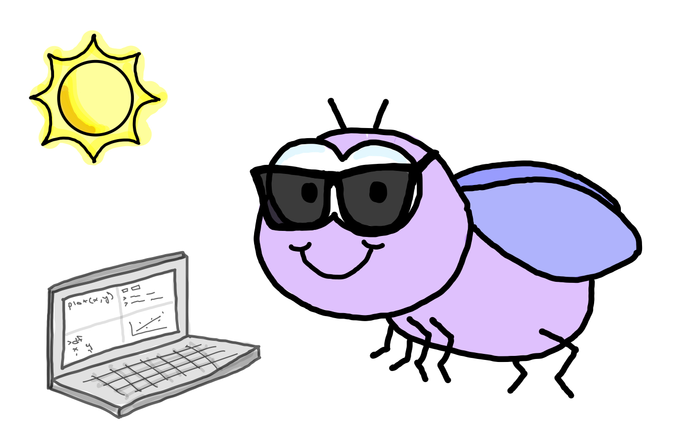

<!-- A quick note to myself about compiling the gitbook. Render this book by using the Knit button in RStudio. When updating the book and knitting again, it may be useful to remove all directories and previous files other than this index.Rmd file. That will avoid saving old files whose sections have been re-named and therefore no longer exist, etc.  -->

```{r, setup, include = FALSE}
knitr::opts_knit$set(root.dir = here::here())
```


# Workshop overview {-}



## Download R & RStudio  {-}

- Follow the instructions [here](https://posit.co/download/rstudio-desktop/) to download R & RStudio to your local machine. 


## Agenda {-}

### Day One {-}

- Create a new R Project
- Download and import data into R
- Use some tidyverse functions
- Create some visualizations 
- Make a few plots on your own
- Maybe some quick statistics

### Day Two {-}

- Statistics
- More advanced figures
- More challenges

## Links {-}

  - [Learning Statistics with R](https://learningstatisticswithr.com/book/){target="_blank"} -- great book with an emphasis on stats
  - [R for Data Science](https://r4ds.hadley.nz/){target="_blank"} -- a wonderfully thorough and useful book that emphasizes the tidyverse
  - [R for Graduate Students](https://bookdown.org/yih_huynh/Guide-to-R-Book/){target="_blank"} -- very accessible introduction to R & the tidyverse
  - [Fundamentals of Data Visualization](https://clauswilke.com/dataviz/){target="_blank"} -- "A guide to making visualizations that accurately reflect the data, tell a story, and look professional." by Claus O. Wilke. This book is great, because it is not at all about programming, but just how to make the best data visualizations.
  - [`ggplot2` book](https://ggplot2-book.org/){target="_blank"} -- detailed introduction to plotting with `ggplot2`
  - [TSO Data Science Workshop](https://tsoleary.github.io/workshop_2023/) -- I created this workshop in 2023 -- it is a fairly opinionated workshop that is also (hopefully) useful as a portal to other people's (maybe more useful) ideas and resources.
  - [TSO ThermoFly Data Science workshop](https://tsoleary.github.io/r_intro/data-science-workshop.html) -- I created this workshop in 2022. It has some data we will be working with today. But it may be useful to some as it includes some more introductory information about R and RStudio.

## Download data {-}

- [`lockwood_et_al_2018_LT50.txt`](https://raw.githubusercontent.com/tsoleary/ecoevo_workshop/refs/heads/main/data/raw/lockwood_et_al_2018_LT50.txt)

- [`lockwood_et_al_2018_survival.txt`](https://raw.githubusercontent.com/tsoleary/ecoevo_workshop/refs/heads/main/data/raw/lockwood_et_al_2018_survival.txt)

# Day One

```{r, file = "src/01_day.R"}
```

# Day Two

```{r, file = "src/02_day.R"}
```


# Session Info {-}

```{r}
sessionInfo()
```